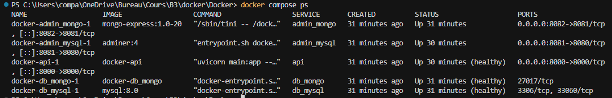
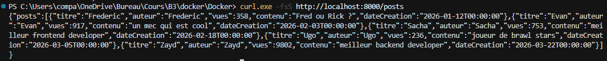
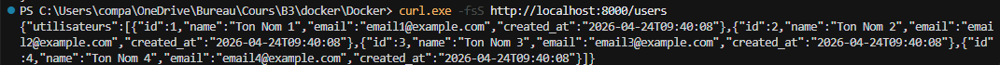

# TP Docker Compose

## Screen3

```bash
docker compose ps
```



## Screen1

```bash
curl.exe -fsS http://localhost:8000/posts
```



## Screen2

```bash
curl.exe -fsS http://localhost:8000/users
```


